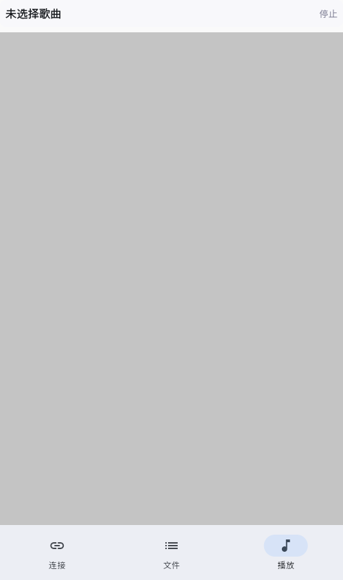
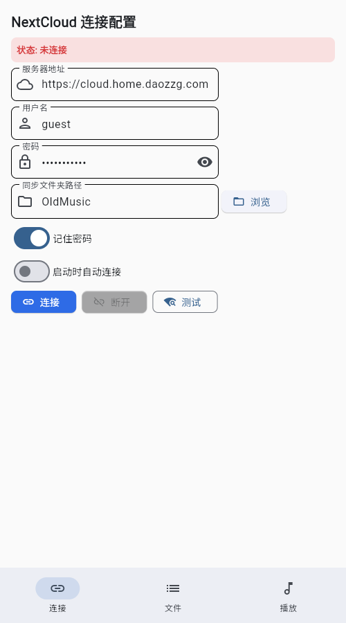
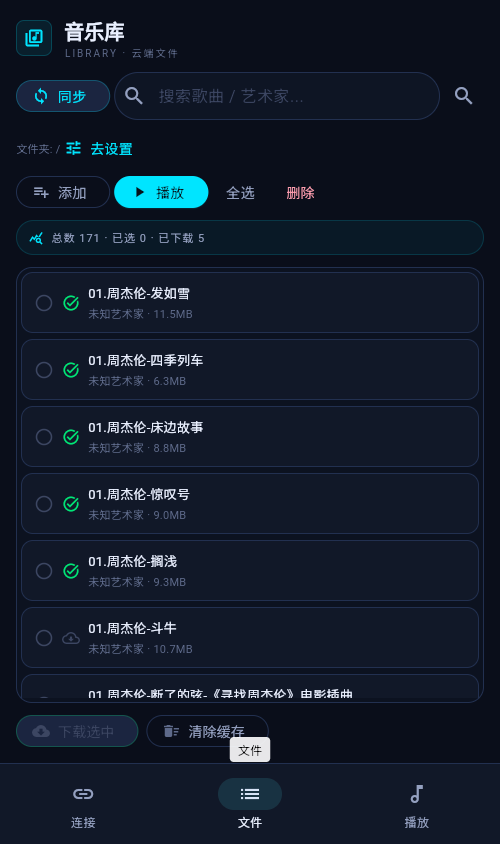
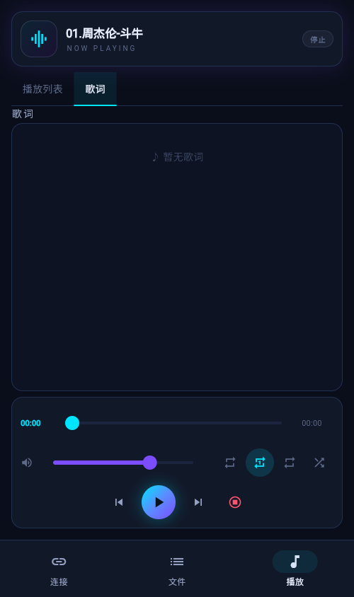

# NextCloud Music Player

免责: 大模型生成的项目,开发学习使用,不保证质量

<div align="center">


**一个基于 Flet (Flutter) 的跨平台音乐播放器，支持 NextCloud 云端音乐同步**

[功能特性](#-功能特性) • [截图预览](#-截图预览) • [安装说明](#-安装说明) • [使用指南](#-使用指南) • [开发指南](#-开发指南) • [自动化构建](#-自动化构建与发布) • [许可证](#-许可证)

</div>

## 📖 项目简介

NextCloud Music Player 是一款现代化的跨平台音乐播放器，专为喜欢使用 NextCloud 云存储服务的用户设计。它能够无缝连接到您的 NextCloud 服务器，同步音乐文件到本地缓存，并提供流畅的音乐播放体验。

项目使用 [Flet](https://flet.dev/) 框架（基于 Flutter 引擎），实现了原生级别的 UI 渲染和流畅的跨平台体验。

### 🎯 设计理念

- **云端同步**：与 NextCloud 无缝集成，自动同步音乐库
- **跨平台**：基于 Flet (Flutter) 框架，支持 macOS、Linux、Windows、iOS 和 Android
- **智能缓存**：本地缓存管理，支持离线播放
- **用户友好**：现代化的 Material Design 界面，简单易用

## ✨ 功能特性

### 🎵 音乐播放功能
- **多格式支持**：支持 MP3、FLAC、AAC 等常见音频格式
- **智能播放列表**：支持创建、管理和保存播放列表
- **播放模式**：顺序播放、随机播放、单曲循环、列表循环
- **播放控制**：播放/暂停、上一曲/下一曲、进度控制、音量调节
- **歌曲信息**：显示歌曲标题、艺术家、专辑等元数据信息

### ☁️ NextCloud 集成
- **服务器连接**：支持自定义 NextCloud 服务器地址
- **安全认证**：支持用户名/密码和应用专用密码认证
- **增量同步**：只下载新文件，避免重复传输
- **文件夹选择**：可选择特定文件夹进行同步
- **缓存管理**：智能本地缓存，支持缓存大小限制

### 📂 SMB 共享来源
- **来源切换**：连接页支持在 NextCloud 与 SMB 共享之间切换
- **协议支持**：SMB1/SMB2（纯 Python 实现 pysmb，桌面/Web/iOS/Android 全平台可用）
- **灵活配置**：主机地址、端口（445/139）、共享名、域、凭据均可自定义
- **目录浏览**：与 NextCloud 一致的远程文件夹浏览与同步体验
- **限制说明**：不支持强制 SMB3 加密的服务器，请在服务端允许 SMB2 访问

### 📱 用户界面
- **底部导航**：连接设置、文件列表、播放控制三个主要视图
- **Tab 切换**：播放列表与歌词即时切换
- **进度显示**：实时显示播放进度和时间
- **响应式设计**：适配不同屏幕尺寸，支持 iOS SafeArea
- **歌词同步**：支持 LRC 格式歌词，自动高亮当前行并滚动

### 🔧 高级功能
- **离线播放**：缓存的音乐可离线播放
- **播放历史**：记录播放次数和最后播放时间
- **收藏功能**：支持标记喜爱的歌曲
- **日志系统**：完善的日志记录，便于问题诊断

## 📸 截图预览

<div align="center">

### 播放视图


### 连接设置视图


### 文件列表视图


### 歌词视图


</div>

## 🚀 安装说明

### 📦 从源码运行（推荐）

1. **克隆仓库**
   ```bash
   git clone https://github.com/zgfh/nextcloud-music-player.git
   cd nextcloud-music-player
   ```

2. **安装依赖并运行**（推荐 [uv](https://docs.astral.sh/uv/)）
   ```bash
   uv sync --extra desktop      # 桌面播放需要 pygame
   uv run python -m nextcloud_music_player
   ```

   或使用 pip：
   ```bash
   python -m venv .venv
   source .venv/bin/activate    # Windows: .venv\Scripts\activate
   pip install -e ".[desktop]"
   python -m nextcloud_music_player
   ```

### 桌面平台

直接运行即可：
```bash
python -m nextcloud_music_player
```

### iOS 平台

推荐使用一键部署脚本（自动检测设备、增量构建、自动签名并安装，免费开发者账号签名 7 天有效，到期重跑续签）：
```bash
bash scripts/deploy_iso.sh           # 自动：源码有更新则重建，否则仅续签
bash scripts/deploy_iso.sh --rebuild # 强制完整重建
bash scripts/deploy_iso.sh --refresh # 仅刷新签名（代码未变时，速度快）
```

手动构建（需 macOS + Xcode + CocoaPods，详见 [docs/MOBILE_BUILD_GUIDE.md](docs/MOBILE_BUILD_GUIDE.md)）：
```bash
flet build ipa --yes   # 打包 Python 并生成 Flutter 工程（产物未签名，无法直接装真机）
# 写入 build/flutter/ios/exportOptions.plist（development + 自动签名 + teamID）后：
cd build/flutter && flutter build ipa --release --export-options-plist ios/exportOptions.plist

# 安装到设备
xcrun devicectl list devices  # 找到设备 ID
xcrun devicectl device install app --device <DEVICE_ID> build/flutter/build/ios/ipa/nextcloud_music_player.ipa
```

### Android 平台

```bash
flet build apk
```

### 系统要求

- **Python**: 3.10 或更高版本（Flet 0.86 要求）
- **Flet**: 0.86.0+
- **操作系统**: macOS 10.14+、Ubuntu 18.04+、Windows 10+
- **iOS 构建**: macOS + Xcode 14+ + CocoaPods + Flutter SDK（flet 0.86.5 对应 Flutter 3.44.x）
- **NextCloud**: 兼容 NextCloud 20+ 版本

## 📱 使用指南

### 首次设置

1. **启动应用**：运行应用后，点击底部导航栏的"连接"标签
2. **配置服务器**：
   - 输入您的 NextCloud 服务器地址（如：`https://cloud.example.com`）
   - 输入用户名和密码（推荐使用应用专用密码）
3. **测试连接**：点击"测试连接"按钮验证设置
4. **选择文件夹**：点击"选择文件夹"按钮选择音乐文件夹路径（如：`/Music`）

### 音乐同步

1. **点击同步**：在"文件"标签页点击"同步音乐文件"
2. **查看文件**：同步完成后，音乐文件将显示在列表中
3. **下载状态**：绿色图标表示已下载，红色表示仅在云端

### 音乐播放

1. **添加到播放列表**：
   - 在文件列表中选择音乐文件，点击"添加到播放列表"
   - 或直接点击文件进行播放
2. **播放控制**：
   - 使用 ▶ ⏸ 按钮控制播放/暂停
   - 使用 ⏮ ⏭ 按钮切换歌曲
   - 拖动进度条调整播放位置
3. **播放模式**：点击播放模式按钮切换：
   - 顺序播放
   - 单曲循环
   - 全部循环
   - 随机播放
4. **歌词**：切换到"歌词"标签查看当前歌曲歌词，支持自动滚动和高亮

## 🛠 开发指南

### 项目结构

```
nextcloud-music-player/
├── src/nextcloud_music_player/
│   ├── __main__.py              # 入口 (ft.run)
│   ├── app.py                   # Flet 主入口
│   ├── nextcloud_client.py      # NextCloud API 客户端
│   ├── music_library.py         # 音乐库管理
│   ├── config_manager.py        # 配置管理
│   ├── platform_audio.py        # 平台音频抽象
│   ├── services/                # 业务逻辑服务（与框架无关）
│   │   ├── music_service.py     # 音乐服务
│   │   ├── playback_service.py  # 播放服务
│   │   ├── playback_controller.py # 播放控制器
│   │   ├── playlist_manager.py  # 播放列表管理
│   │   └── lyrics_service.py    # 歌词服务
│   ├── views/                   # Flet UI 视图
│   │   ├── view_manager.py      # 视图管理器 (NavigationBar)
│   │   ├── connection_view.py   # 连接设置视图
│   │   ├── file_list_view.py    # 文件列表视图
│   │   ├── playback_view.py     # 播放控制视图
│   │   ├── folder_selector.py   # 文件夹选择器
│   │   └── components/          # 可复用组件
│   │       ├── playback_control_component.py
│   │       ├── playlist_component.py
│   │       └── lyrics_component.py
│   └── utils/                   # 工具类
│       ├── theme.py             # 主题配色
│       └── platform_ui.py       # 平台 UI 适配
├── docs/screenshots/            # 应用截图
├── scripts/                     # 部署脚本
│   └── deploy_iso.sh            # iOS 部署脚本
└── pyproject.toml               # 项目配置
```

### 技术栈

- **UI 框架**: [Flet](https://flet.dev/) 0.86.5 - 基于 Flutter 的跨平台 UI 框架
- **音频播放**: [Pygame](https://www.pygame.org/) - 跨平台音频处理（桌面）
- **网络请求**: [httpx](https://www.python-httpx.org/) - 现代 HTTP 客户端
- **配置管理**: JSON 格式配置文件
- **日志系统**: Python 标准 logging 模块

### 架构设计

应用采用分层 MVC 架构：

- **Model**: `music_library.py`、`config_manager.py` - 数据模型和配置
- **View**: `views/` 目录下的 Flet 视图组件 - 用户界面
- **Controller**: `services/` 目录下的服务类 - 业务逻辑（完全与 UI 框架解耦）

服务层设计为框架无关，可复用于任何 UI 框架。

### 开发环境设置

推荐使用 [uv](https://docs.astral.sh/uv/) 管理环境（仓库已带 `uv.lock`，锁定全部依赖版本）：

```bash
uv sync --extra dev                       # 单元测试 + 格式化 + e2e（含 flet[test]）
uv sync --extra dev --extra desktop       # 叠加桌面播放（pygame）

uv run python -m nextcloud_music_player   # 运行应用
```

没有 uv 时也可以用 pip：

```bash
pip install -e ".[dev,desktop]"
```

### 运行测试

```bash
uv run pytest tests/ -v    # 单元/交互测试（详见下文「测试」一节）
```

### 代码格式化与检查

```bash
uv run black src/                          # 格式化（CI 用 --check 做门禁）
uv run isort src/                          # import 排序（profile=black，见 pyproject.toml）

# CI 同款门禁命令，提交前建议本地跑一遍：
uv run black --check src/ && uv run isort --check-only src/
uv run flake8 src/ --select=E9,F63,F7,F82  # 语法/未定义名称检查（阻塞项）
```

### 🐞 调试

#### 方式一：热重载开发（日常迭代，秒级生效）

Python 跑在电脑上，手机只做 UI 渲染，改代码保存即热更新，无需重新打包签名：

```bash
flet run --ios -r -p 8551  # iOS 真机（-r 递归监听 src/；-p 固定端口，地址保持不变）
flet run --android -r      # Android 真机
flet run -w                # 浏览器（最轻量）
flet run                   # 桌面窗口
```

以 iOS 为例：手机从 App Store 安装免费的 [Flet](https://apps.apple.com/app/flet/id1624979699) app，与电脑同一 Wi-Fi，在 Flet app 中输入终端显示的地址（如 `http://192.168.x.x:8551/src/main.py`）即可连接，也可扫终端里的二维码。

> 排查提示：若改了代码手机上没变化，先杀掉 Flet app 重连；仍不行则检查电脑上是否有泄漏的旧进程占用端口（`lsof -i :8551`），清理后重启 `flet run`。

**限制**：Python 在电脑端执行——联网走电脑的网络（电脑必须能访问 NextCloud 服务器）；iOS 平台专属能力（后台音频、`rubicon-objc`）不生效。界面偶发的键盘残留灰块是伴生 app webview 的渲染问题，滑动屏幕即可恢复，与本项目代码无关。

#### 方式二：真机整机调试 `flet debug`（验证平台能力 / 看前端报错）

构建完整 app（Python 打包进手机）并直接运行，Dart/Flutter 前端的报错和日志实时输出到终端：

```bash
flet devices                          # 查看设备 ID
flet debug ios --device-id <ID> -v    # 首次加 -v 排查问题
```

**要求与注意**：手机需用 **USB 线**连接（`flutter run` 不识别纯 Wi-Fi 连接的设备）；首次构建较慢，之后有增量缓存；会用 debug 签名覆盖手机上同 bundle id 的正式版。

#### 方式三：真机截图与系统日志（USB）

基于 [libimobiledevice](https://libimobiledevice.org/)（`brew install libimobiledevice`），排查"手机上到底显示成什么样"：

```bash
idevicescreenshot /tmp/phone.png   # 抓取当前屏幕
idevicesyslog                      # 实时系统日志（含崩溃信息）
```

#### 辅助技巧

- **手机布局复现**：用 Chrome DevTools CLI 以手机尺寸渲染热重载会话，可截图、可交互，无需手机即可复现布局问题（见下条）。
- **应用日志**：`~/Library/Application Support/nextcloud_music_player/logs/nextcloud_music_player.log`（macOS；热重载模式下所有会话共用此文件）
- **Chrome DevTools CLI 交互式调试**（本次 README 截图即用此方式生成）：比一次性无头截图更进一步，可真实点击、切换标签、逐视图截图，适合批量更新 `docs/screenshots/`：
  ```bash
  npm i -g chrome-devtools-mcp      # 提供 chrome-devtools 命令
  uv run flet run -w -p 8550 &      # 启动 web 热重载会话

  chrome-devtools start --allowUnrestrictedPaths=true  # 允许把截图写到仓库目录
  chrome-devtools new_page "http://localhost:8550"
  chrome-devtools resize_page 390 844                 # 切换到手机竖屏
  chrome-devtools take_screenshot --filePath docs/screenshots/playback_view.png

  # Flutter Web 默认不开无障碍语义树，快照/点击前需先激活：
  chrome-devtools evaluate_script "() => { const b=document.querySelector('flt-semantics-placeholder'); b.focus(); b.dispatchEvent(new KeyboardEvent('keydown',{key:'Enter',bubbles:true})); }"
  chrome-devtools take_snapshot   # 之后即可拿到各元素 uid，用 click 切换视图后逐张截图
  ```

## 🧪 测试

测试分两层，都不需要真实 NextCloud/SMB 服务器，全部可在本地自动运行。

### 1. 无头交互测试（pytest，日常开发首选）

不启动界面、不连真实网络，用替身（FakeNextcloudClient 可模拟慢网络/下载失败/404）驱动真实的视图代码，全自动断言交互行为，**无需截图人工核对**，秒级跑完：

- **播放**：未下载歌曲的"下载中"提示、切歌先停旧歌、连点两首时慢下载不会顶掉最新选择、下载失败/播放失败的状态反馈
- **连接**：连接中禁用按钮、成功跳转文件列表、凭据错误/网络异常提示、SnackBar 走 `show_dialog`
- **文件夹选择**：对话框打开/关闭、目录导航、目录 404 自动回退根目录
- **文件列表**：同步进度提示、同步失败反馈、同步中重复点击防抖、搜索过滤

```bash
uv run pytest tests/ -v                                   # 全部（约 4s）
uv run pytest tests/test_playback_interactions.py -v      # 只跑播放交互
uv run pytest tests/ --cov=src/nextcloud_music_player --cov-report=html   # 覆盖率
```

### 2. 端到端 UI 测试（flet test，真实 Flutter 渲染管线）

`tests/e2e/` 使用 Flet 官方测试框架（`flet.testing`）：FletTestApp 启动 Python 应用 + 真实 `flutter test` 进程（完整渲染管线，非 fake），Tester 提供 `find_by_text / find_by_key / tap / pump_and_settle` 等交互 API，还能 `take_screenshot` 做 golden 截图对比。目前覆盖：

- 连接页 Nextcloud ⇄ SMB 来源切换（表单挂载与标题联动）、SMB 向导弹窗
- **Nextcloud 全链路**（`test_nextcloud_full_flow.py`）：内置 Mock Nextcloud/WebDAV 服务器（`tests/mock_nextcloud.py`），跑通 建立连接 → 同步 → 下载 → 选择歌曲 → AVFoundation 播放
- **错误路径**：密码错误出 SnackBar 提示且可立即重连恢复、服务器不可达立即反馈

Mock 服务器支持 Basic Auth（校验真实登录流程）与故障注入（`server.set_fault(status=401)` / `drop=True` / `delay_seconds=…`，模拟 404、断线、慢响应），客户端层的异常分支由 `tests/test_nextcloud_mock_integration.py` 覆盖。模拟器与 Mac 共享 127.0.0.1，应用直接连测试进程内的 mock 服务，无需任何外部依赖。

```bash
# 方式一：本机桌面平台（默认，首次运行会 provision 测试宿主，较慢；
# 注意切换平台前先 flet clean，避免旧 flutter-packages 路径依赖残留）
uv run flet test --tests-dir tests/e2e

# 方式二：iOS 模拟器（与 CI 完全一致，渲染管线同真机）
xcrun simctl list devices available | grep iPhone    # 任选一个模拟器 UDID
uv run flet test ios --no-swift-package-manager --device-id <UDID> --tests-dir tests/e2e -v
```

前置条件：Flutter 3.44.x（与 flet 0.86.5 配套）；依赖已含在 `uv sync --extra dev` 中（`flet[test]` 提供 numpy/pillow/scikit-image，golden 截图对比用）。

> **本地跑 iOS e2e 的两个缓存坑**：
> 1. 切换目标平台（桌面 ⇄ iOS）前先 `flet clean`，否则 `build/flutter-packages` 的路径依赖会让构建失败。
> 2. iOS 用 CocoaPods 集成（`--no-swift-package-manager`）时，serious-python 打包的应用代码会缓存在 CocoaPods 产物里——`flet clean` 清不掉 `~/Library/Caches/CocoaPods`。改了 Python 源码但模拟器里行为没变时，执行 `pod cache clean --all`（或删除该缓存目录）后重跑。

> **已知问题**（flet 0.86.5 device 模式）：Python 侧断言可能全部通过（pytest 汇总 `1 passed`），但 Dart 侧 `testWidgets` 收尾阶段以 exit code 1 结束且无异常输出，teardown 因此追加一个 ERROR。这是 flet 上游测试框架的 bug，CI 中该 job 已标记 `continue-on-error`；判断测试是否真的通过，看 pytest 汇总行是否 `passed`。桌面平台模式通常无此问题。

截图验证仅用于发布前的视觉效果检查，交互行为回归全部由上述自动化测试承担。

## 📦 构建与发布

### 本地构建

```bash
# 直接运行
uv run python -m nextcloud_music_player

# 或使用 flet build 出各平台包（需 Flutter 3.44.x）
uv run flet build macos     # macOS（.app）
uv run flet build linux     # Linux（bundle 目录）
uv run flet build windows   # Windows（exe 目录）
uv run flet build apk       # Android APK
```

iOS 真机包需签名证书，推荐一键部署脚本（自动检测设备、增量构建、签名并安装；免费开发者账号签名 7 天有效，到期重跑续签）：

```bash
bash scripts/deploy_iso.sh
```

### CI 自动化（GitHub Actions）

PR 与 main push 会触发三条工作流（详见 [.github/workflows/README.md](.github/workflows/README.md)）：

- **Code Quality**：flake8 语法门禁 + black/isort 格式检查（阻塞），mypy、bandit/safety（非阻塞）
- **E2E Tests**：全量 pytest，随后在 macOS runner 的 iOS 模拟器上跑 `flet test`（flet-e2e job 因上文提到的上游收尾 bug 暂时 `continue-on-error`）
- **Build and Release**：`flet build` 出 5 平台产物（Android APK / iOS 模拟器验证包 / macOS / Linux / Windows），产物上传为 artifact；main push 额外发布 dev release，正式版随 GitHub Release 发布（`release.yml` 在 v* tag 时自动生成 changelog 和 Release）

## 📄 许可证

本项目采用 BSD 3-Clause 许可证。详见 [LICENSE](LICENSE) 文件。

## 🤝 贡献

欢迎贡献代码！请按照以下步骤：

1. Fork 本仓库
2. 创建特性分支 (`git checkout -b feature/AmazingFeature`)
3. 提交更改 (`git commit -m 'Add some AmazingFeature'`)
4. 推送分支 (`git push origin feature/AmazingFeature`)
5. 开启 Pull Request

## 🙏 致谢

- [Flet](https://flet.dev/) - 基于 Flutter 的跨平台 Python UI 框架
- [NextCloud](https://nextcloud.com/) - 开源云存储解决方案
- [Pygame](https://www.pygame.org/) - 跨平台游戏和多媒体库

---

<div align="center">

**如果这个项目对您有帮助，请给它一个 ⭐ Star！**

Made with ❤️ by the NextCloud Music Player Team

</div>
